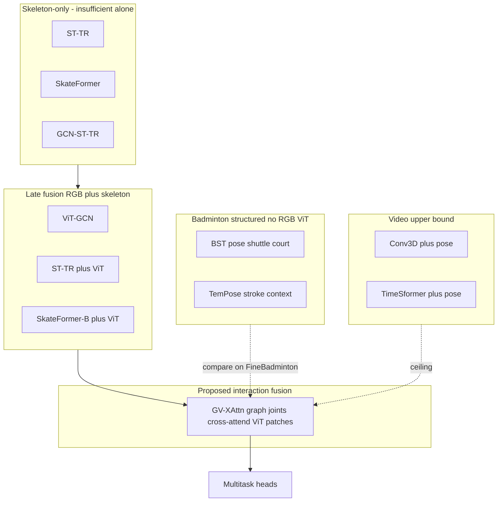
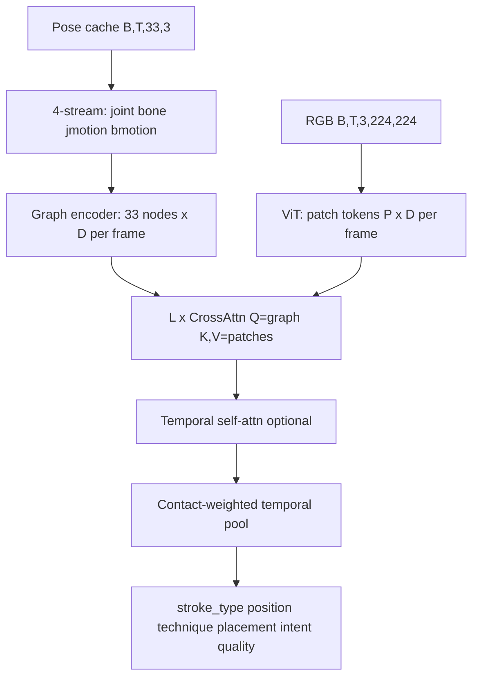

# GV-XAttn: Graph–Vision Cross-Attention for Badminton Stroke Recognition

IsoCourt research plan — **badminton SOTA on FineBadminton-20K**, not general NTU action recognition.

**Status:** SkateFormer-B + ViT (late fusion) in training; GV-XAttn is the **next architecture** to implement after that run completes.

---

## 1. Goal

Build and evaluate **GV-XAttn** (Graph–Vision Cross-Attention): graph joint tokens from MediaPipe pose **cross-attend to ViT image patch tokens** before clip-level pooling, for multitask stroke classification on **FineBadminton-20K**.

**v1 constraints (agreed):**

- Same protocol as other IsoCourt primary trainers: **16 frames**, `frame_interval=2`, MediaPipe **33** joints, `video_level_split` seed **42**, batch **4**.
- Reuse `pose_cache_mediapipe.pt` and RGB clips — **no shuttle track / court homography** in v1.
- Compare fairly against **BST / TemPose baselines** and **late-fusion RGB+pose** (SkateFormer-B, ViT-GCN, Conv3D+pose).

---

## 2. SOTA definition (badminton-first)

| Priority | Benchmark | Metric |
|----------|-----------|--------|
| **Primary** | FineBadminton-20K (merged JSON, hit-span 16 frames) | Val **`stroke_type`** accuracy |
| **Internal ceiling** | Conv3D+pose on same split | ~**71%** (registry primary) |
| **Badminton field** | BST / TemPose **re-implemented** on same labels/split | Fair stroke_type comparison |
| **Not primary** | NTU RGB+D, ShuttleSet-only published numbers, PAN/MMCL | Methodology cite only |

**Success (any one is a strong result):**

1. Beat **SkateFormer-B** (late fusion) by **≥ 2–3 pts** val stroke_type, or  
2. Beat **Conv3D+pose** (~71%) on the same split, or  
3. Beat **BST baseline** on FineBadminton (same reimplementation protocol).

---

## 3. Position in the IsoCourt model ladder

| Model | Skeleton | Vision | Fusion |
|-------|----------|--------|--------|
| ViT-GCN | GCN per frame, pool | ViT CLS, pool | Concat |
| ST-TR+ViT | ST-TR pool | ViT mean+max | Concat + MLP |
| SkateFormer-B | SkateFormer 4-stream pool | ViT mean+max | Concat + MLP |
| **GV-XAttn** | Graph node tokens `(B,T,33,D)` | ViT **patch** tokens `(B,T,P,D)` | **Cross-attn per frame**, then temporal pool |
| BST (baseline) | J+B, COCO-17 | — | Shuttle + court (structured) |

**Novelty wedge:** joints **read out** image evidence before pooling — not another late-concat multimodal stack.

---

## 4. Architecture: GV-XAttn

### 4.1 One-sentence claim

*Joint-level graph tokens from four-stream pose interact with per-frame ViT patch tokens via cross-attention before temporal pooling, so racket, shuttle appearance, and court context can condition kinematics without explicit shuttle tracking.*

### 4.2 Data flow

### 4.3 Modules

| # | Module | Source / new | Output |
|---|--------|--------------|--------|
| 1 | Four-stream pose | `backend/core/skeleton_streams.py` | `(B, T, 33, 12)` |
| 2 | Graph token encoder | **New** in `gv_xattn.py`; reuse `FixedGCNStack` from `vit_gcn.py` | `(B, T, 33, D)` |
| 3 | ViT patch encoder | Extend `ViTClipEncoder` in `st_tr_vit_fusion.py` with `forward_tokens()` | `(B, T, P, D)` |
| 4 | Cross-attention fusion | **New**; `L = 2–4` blocks, same-frame Q=graph, K,V=patches | Updated graph tokens |
| 5 | Temporal aggregation | **New**; contact weights from wrist speed / bone motion | `(B, D)` clip vector |
| 6 | Multitask heads | Same task schema as `FineBadmintonDataset` | Logits per task |

**Contact-weighted pool (badminton-specific, v1):**  
Softmax over `T` using per-frame motion magnitude (e.g. max bone-motion or wrist speed from streams 3–4). Ablation: mean/max pool like other models.

**Optional v2:** shuttle node + 2D track; adjacent-stroke context (TemPose-TF-ASF line).

### 4.4 Training (match SkateFormer-B)

| Setting | Value |
|---------|-------|
| Script | `backend/pipelines/training/train_gv_xattn.py` (to add) |
| Epochs | 60 |
| Batch | 4 |
| LR | 1e-4; skel ×0.25, vit ×1.0, fusion ×5.0 |
| Stroke-only warmup | 8 epochs |
| Loss | stroke 5.0 / aux 0.25 |
| Aug | medium |
| MLflow | `IsoCourt_Training_GV_XAttn` |
| Checkpoint | `backend/models/badminton_model_gv_xattn.pth` |
| Registry | `gv_xattn` |
| EC2 tmux | `./scripts/ec2/run_train_tmux.sh gv_xattn` |

---

## 5. Related work

### 5.1 Tier A — Badminton / racket (primary citations)

| Work | When | Inputs | Role in comparison |
|------|------|--------|-------------------|
| [BST](https://arxiv.org/html/2502.21085v4) | CVPRW 2026 | Pose, **shuttle**, **court**, J+B | Main structured badminton competitor; `train_bst_baseline.py` |
| [TemPose-TF-ASF](https://arxiv.org/html/2605.02558) | 2026 | Skeleton + **prev/next stroke** | Temporal context fusion; not RGB |
| TemPose | CVPRW 2023 | Skeleton + shuttle + court | Predecessor; brief cite |
| ShuttleSet / BadmintonDB | — | BST full pipeline | Table 3 only — different protocol |

**Opportunity:** BST uses shuttle+court; we use **RGB ViT** as visual substitute on FineBadminton without TrackNet.

### 5.2 Tier B — Methodology (appendix / one paragraph)

| Work | When | Borrowed idea |
|------|------|----------------|
| [SkateFormer](https://arxiv.org/pdf/2403.09508) | ECCV 2024 | 4-stream skeleton encoder |
| [PAN](https://arxiv.org/abs/2512.21916) | 2025 | Human-centric graph + vision (contrast, not badminton SOTA) |
| [MAF-Net](https://journals.plos.org/plosone/article?id=10.1371/journal.pone.0319656) | 2025 | Skeleton-guided RGB attention |

Pre-2024 RGB+skeleton fusion (e.g. STAR-Transformer WACV 2023) — optional historical sentence only.

### 5.3 What we claim vs do not claim

**Claim (if ablations support):**

- Graph joints **cross-attend** to ViT patches before stroke classification on **FineBadminton-20K**.
- **Contact-aware** temporal pooling for short hit clips.
- Systematic comparison vs **late fusion** and **BST reimplementation** on one protocol.

**Do not claim:**

- First graph + image fusion for action recognition.
- Novelty of joint/bone/motion streams (BST, SkateFormer).
- SOTA on NTU or vs PAN.

---

## 6. Evaluation tables

Recreate **`docs/paper_eval_tables.md`** (badminton-centric).

### Table 1 — Main results (FineBadminton-20K only)

| Model | RGB | Pose | Shuttle / court | Val stroke_type |
|-------|-----|------|-----------------|-----------------|
| CNN-LSTM | ✓ | opt | — | (fill) |
| Conv3D+pose | ✓ | ✓ | — | ~71% |
| TimeSformer+pose | ✓ | ✓ | — | ~53% |
| ViT-GCN | ✓ | ✓ | — | (fill) |
| ST-TR | — | ✓ | — | ~11% |
| SkateFormer | — | ✓ | — | (fill) |
| ST-TR+ViT | ✓ | ✓ | — | (fill) |
| SkateFormer-B | ✓ | ✓ | — | (training) |
| **GV-XAttn** | ✓ | ✓ | — | TBD |
| BST baseline | — | ✓ | partial† | (fill) |
| TemPose baseline | — | ✓ | — | (fill) |

† Repo BST baseline: MediaPipe→COCO-17, zeros shuttle; not full paper pipeline.

### Table 2 — Ablations (GV-XAttn)

1. Graph-only (GCN pool, no cross-attn)  
2. ViT-only  
3. Late concat (same features as GV-XAttn, MLP fusion)  
4. Full GV-XAttn  
5. GV-XAttn w/o contact-weighted pool  

### Table 3 — External (not ranked vs Table 1)

Published BST / TemPose on ShuttleSet, BadmintonDB — footnote protocol mismatch.

---

## 7. Implementation checklist

- [ ] **Phase 0:** Let SkateFormer-B finish; record best val stroke_type.  
- [ ] **Phase 1:** `ViTClipEncoder.forward_tokens()` — non-breaking.  
- [ ] **Phase 1:** `backend/core/gv_xattn.py` — `GraphVisionCrossAttnModel`.  
- [ ] **Phase 1:** `train_gv_xattn.py` + registry `gv_xattn` + tmux alias.  
- [ ] **Phase 2:** Run ablations 1–5; fill Table 1–2.  
- [ ] **Phase 2:** Restore `docs/paper_eval_tables.md` from template above.  
- [ ] **Phase 3 (optional):** SkateFormer per-joint features instead of GCN nodes if Phase 2 beats late fusion.  
- [ ] **Phase 4 (optional):** Shuttle node + track for badminton parity with BST.

---

## 8. Code touchpoints

| Path | Action |
|------|--------|
| `backend/core/skeleton_streams.py` | Reuse four-stream builder |
| `backend/core/vit_gcn.py` | Reuse `FixedGCNStack`, `MEDIAPIPE_BODY_EDGES` |
| `backend/core/st_tr_vit_fusion.py` | Add patch-token forward |
| `backend/core/gv_xattn.py` | **New** model |
| `backend/pipelines/training/train_gv_xattn.py` | **New** trainer |
| `backend/core/model_registry.py` | Add `gv_xattn` category |
| `scripts/ec2/run_train_tmux.sh` | Add `gv_xattn` model alias |
| `backend/pipelines/training/train_skateformer_b.py` | Late-fusion control / warm-start reference |

---

## 9. References (quick links)

- BST: https://arxiv.org/html/2502.21085v4  
- TemPose-TF-ASF: https://arxiv.org/html/2605.02558  
- SkateFormer: https://arxiv.org/pdf/2403.09508  
- PAN: https://arxiv.org/abs/2512.21916  
- IsoCourt training standards: `backend/docs/TRAINING_STANDARDS.md` (when present on branch)  
- Model registry: `backend/models/MODEL_REGISTRY.md`
